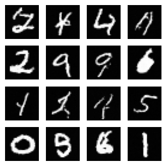

# Denoising Diffusion Probabilistic Models 

## Description

PyTorch implementation of the DDPM paper by [Ho et al. \[2020\]](https://arxiv.org/abs/2006.11239).

Generative model that works by iteratively removing normally distributed noise from a standard normal distribution until an image is formed, referred to as the reverse process.
The forward process used to generate training data is done by starting with an image from a dataset and adding noise to it.

Algorithm 1 and 2 from the paper are implemented in the DDPM class.

    

The model used to learn the added noise is a fully convolutional U-Net based on a series of downsampling and upsampling layers with residual blocks at each resolution.
Multi-headed self attention is also added at certain steps, and the time-dependency is added to each residual block using a sinusoidal positional embedding.

## Training

    

The model is then trained on the MNIST training dataset for 10 epochs leading to the following loss curve:

    

Before any training, sampling from the model leads to images mostly looking like random noise. After training, samples from the model is starting to resemble the images in the MNIST dataset.

    
    

