# Denoising Diffusion Probabilistic Models 

## Description

PyTorch implementation of the DDPM paper by [Ho et al. \[2020\]](https://arxiv.org/abs/2006.11239).

Generative model that works by iteratively removing normally distributed noise from a standard normal distribution until an image is formed, referred to as the reverse process.
The forward process used to generate training data is done by starting with an image from a dataset and adding noise to it.

Algorithm 1 and 2 from the paper are implemented in the DDPM class.

    

The model used to learn the added noise is a fully convolutional U-Net based on a series of downsampling and upsampling layers with residual blocks at each resolution.
Multi-headed self attention is also added at certain steps, and the time-dependency is added to each residual block using a sinusoidal positional embedding.

## Training

Example batch from the MNIST training dataset.

    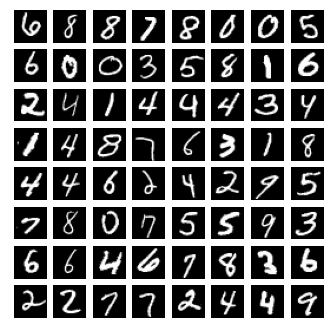

Before any training, sampling from the model leads to images mostly looking like random noise. After training the model on the MNIST training dataset for 10 epochs, samples start to resemble the images from the training.

    
    

## Conditional DDPM

Classifier-Free Diffusion Guidance implementation based on the paper by [Ho & Salimans \[2022\]](https://arxiv.org/abs/2207.12598).

Adds class conditioning to the original DDPM version. Makes it possible to choose a class and generate images from that given class.
This is done by adding the class context to the residual blocks of the U-Net for a guided prediction step.
The final noise predictions at each step is computed as a weighted sum between a guided and unguided prediction for sampling images.

Example images from each class are shown in the table below after training.

    <table>
        <tr>
            <td>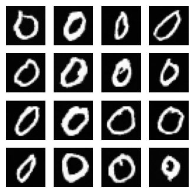</td>
            <td>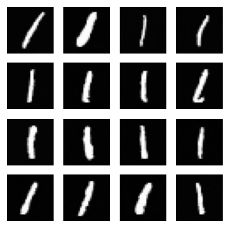</td>
            <td>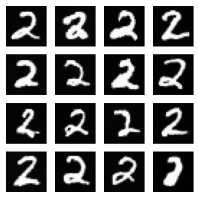</td>
            <td>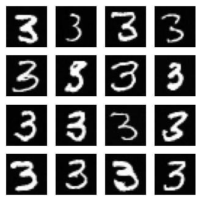</td>
            <td>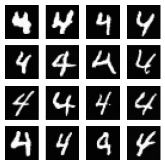</td>
        </tr>
        <tr>
            <td>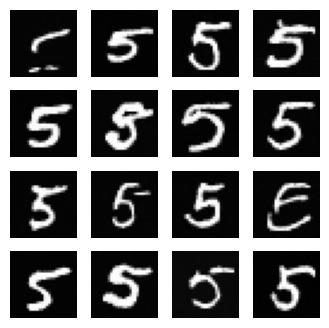</td>
            <td>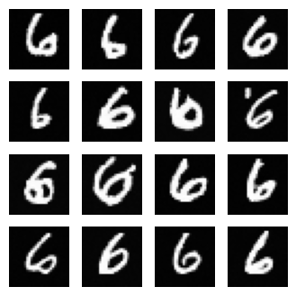</td>
            <td>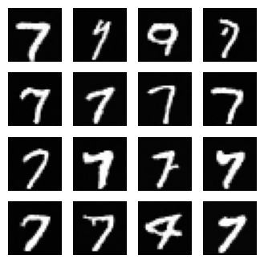</td>
            <td>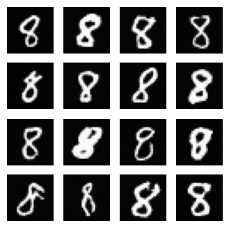</td>
            <td>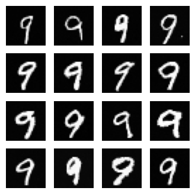</td>
        </tr>
    </table>

